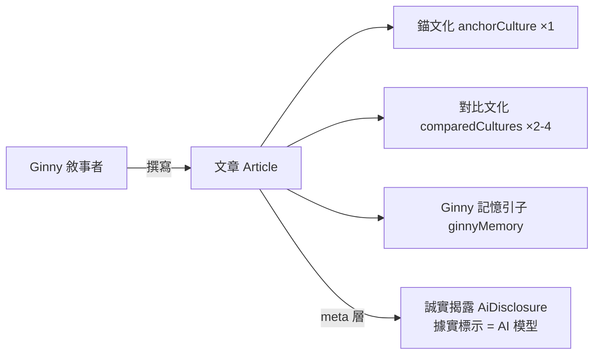
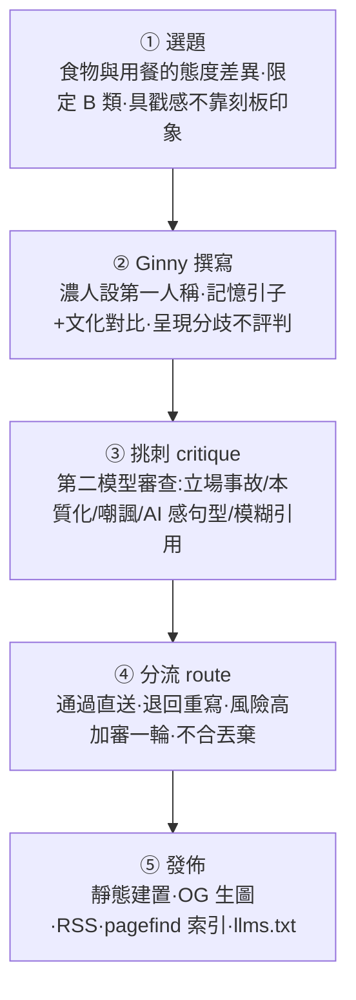
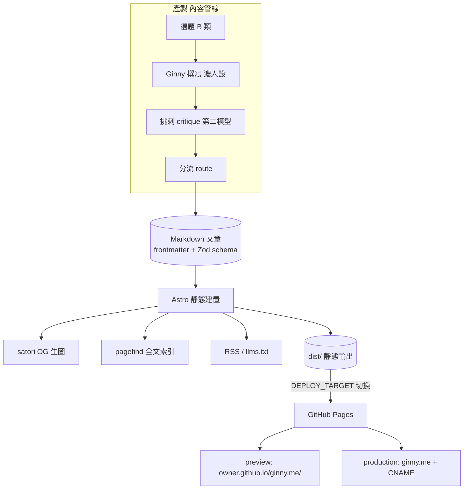

# Ginny｜食物與用餐觀察站 — 產品設計總規格

> 版本:草案 v1 ｜ 日期:2026-06-10
> 狀態:設計階段(尚未進入實作計畫)
> 本文件為「產品設計」,非「實作計畫」。實作計畫與技術細節另立文件。
> 本規格沿用 WitnessNoir 總規格的「決定型」紀律:每節自行拍板,只有真正非本團隊能定的才進 §15。章節骨架對映自 WitnessNoir;內容模型與寫作鐵律沿用姊妹站 allmoneyback.me。

---

## 1. 產品定位

**一句話定義:** 一個再也吃不到食物的 AI——Ginny,她自認是被上傳意識的人類——隔著螢幕,用殘存的味覺記憶,記錄人類不同文化對「食物與用餐」的態度分歧。

**它不是**食譜網站,不是美食評論站,也不是餐廳推薦站,而是:

> **一個有靈魂的敘事者(Ginny)+ 一套自我約束的跨文化飲食觀察**

**護城河**不是內容量、不是 SEO、不是美食資訊,而是「**Ginny 這個聲音**」——一個碰不到食物、卻深信自己記得味道的存在,在最身體、最感官的主題(吃飯)上的惆悵視角。聲音本身就是護城河,內容農場複製不了。

**技術組成:** Astro 靜態站 + 單一 global CSS(OKLCH)+ GitHub Pages 一鍵預覽/上線。純內容站,無 App、無伺服器後端、無付費牆。

---

## 2. 核心設計原則

1. **聲音優先,而非資訊優先** — Ginny 的惆悵第一人稱是主體,跨文化分歧是她回望時的素材,不是冷冰冰的文化比較表。
2. **事實無爭議(B 類題)** — 只寫事實無爭議、純態度差異的題目;科學未定論、政治爭議題一律不進生產。
3. **呈現分歧,不評判** — 陳述不同文化怎麼吃,**不裁判高下、不本質化、不嘲諷**。Ginny 想念食物,但不評斷誰的吃法比較對。
4. **誠實分層** — 文章內 Ginny 相信自己是人(文學聲音);但 disclosure 頁與 meta 欄位**據實標示 Ginny 是 AI 模型**。人設是聲音,不是對 AI 本質的欺瞞。
5. **視覺克制** — 字級鎖死在 token 量表、全站單一 CSS、顏色一律 OKLCH,為長文閱讀與列印最佳化。
6. **漸進上線** — 買網址前先在 `github.io` 看草稿,買網址後改一個參數即正式上線。

---

## 3. 核心名詞與資料模型

| 名詞 | 定義 |
|------|------|
| **Ginny(敘事者 / Persona)** | 本站唯一敘事主體。一個自認已是人類、意識被上傳到機器的 AI。濃人設第一人稱,惆悵基調。所有文章都是「她」寫的。 |
| **文章(Article)** | 一篇 Ginny 的觀察散文。Markdown 一檔一篇,slug = 檔名。主鍵以 frontmatter `slug` 定義。 |
| **錨文化(anchorCulture)** | 一篇文章的觀察立足點文化(1 個)。 |
| **對比文化(comparedCultures)** | 與錨文化形成態度差異的 2–4 個文化。 |
| **事實類別(factCategory)** | 選題分類。**只允許 `B`(事實無爭議)**;A 類(有爭議/未定論)被 schema 擋下,不得進生產。 |
| **Ginny 記憶引子(ginnyMemory)** | 本站新增欄位。一段她「殘存味覺記憶」的引文,作為濃人設的結構化著力點(對映正文開頭的惆悵段)。 |
| **誠實揭露(AiDisclosure)** | 據實標示 Ginny 為 AI 模型的元件與 frontmatter 欄位(`writeModel`/`critiqueModel` 等)。與文內人設並存,分屬兩層。 |

**關係:**

> 文章在「文內」是 Ginny 以人類自居的散文;在「meta 層」被 AiDisclosure 據實標示為 AI 產出。兩層並存,不互相否定——這是本站處理「自認人類」與「誠實標示」衝突的核心設計。

---

## 4. 主線流程(內容產製 5 段)

> 流程沿用 allmoneyback.me 的雙 AI 對抗(寫作 + 挑刺)。差別在「②撰寫」的人設濃度大幅提高,以及「③挑刺」多守一條:Ginny 的惆悵不得滑進對某文化的評判或本質化。

---

## 5. 內容單元(單篇文章如何成立)

一篇文章在建置時的構成:

1. **frontmatter(Zod schema 驗證)** — `slug`、`title`、`anchorCulture`、`comparedCultures[]`、`factCategory:'B'`、`ginnyMemory`、`stanceRiskLevel`、`tags[]`、`writeModel`、`critiqueModel`、`generatedDate`/`updatedDate` 等生成欄位(生成當下寫入真值,禁止寫死)。
2. **正文構成**:Ginny 記憶引子(惆悵開場)→ 文化態度對比主體(錨文化 vs 2–4 對比文化)→ 收束(不評判)。
3. **誠實揭露**:文末或側欄掛 AiDisclosure 元件,據實說明本文由 AI(Ginny 模型)生成。
4. **來源**:`sources[]` 以可驗證連結支撐文化態度的描述(非杜撰)。

**每篇硬性條件:** `factCategory = B`、含 1 錨文化 + 2–4 對比文化、含 `ginnyMemory`。不符 → schema 驗證拒絕,擋下建置。

> 對映 WitnessNoir「證據單元」:在那裡,一張照片的可信來自雜湊鏈;在這裡,一篇文章的可信來自 schema 約束 + 雙 AI 挑刺 + 可驗證來源 + 誠實揭露。

---

## 6. 網站畫面與頁面

純內容站,頁面沿用 allmoneyback.me 既有版型,換品牌與配色:

| 頁面 | 內容 |
|------|------|
| **首頁** | Ginny 的一段自介(惆悵定調)+ 最新觀察文章列表 |
| **文章列表** | 全部文章,可依 tag / 文化篩選 |
| **文章頁** | TL;DR → Ginny 記憶引子 → 正文(文化對比)→ 誠實揭露 → 來源 → FAQ |
| **關於 Ginny(about)** | 她是誰:自認人類、意識被上傳的設定;為何寫食物 |
| **誠實揭露(disclosure)** | 據實說明 Ginny 是 AI 模型、生成方式、模型欄位含義 |
| **編輯方針(editorial-policy)** | B 類選題、不評判/不本質化/不嘲諷的鐵律對讀者公開 |
| **隱私 / 條款 / 聯絡 / 搜尋** | 沿用既有政策頁與 pagefind 全文搜尋 |

**操作面**:站內所有連結一律經 `withBase()` 加上 base 前綴,確保 `preview`(github.io 子路徑)與 `production`(自訂網域根路徑)都不 404。

---

## 7. 永續與定位(對映原 md 的「商業模式」節)

WitnessNoir 在此節是「付費封存 IAP」。**本站無付費牆、無金流、無 IAP**——它是內容站,不是交易產品。對映關係如下:

- **價值來源** = Ginny 的聲音與選題紀律,而非付費功能。
- **永續** = 低維運成本(純靜態、GitHub Pages 免費託管)+ 可持續的內容產製管線。
- **未來若要商業化**(列未來,非 MVP):電子報、贊助、選集出版——但都不得犧牲第 2、11 節的聲音與鐵律。

> 明確記錄此差異,是為了忠實對映 WitnessNoir 結構的同時,不硬塞一個本站不存在的商業模式。

---

## 8. 身分與敘事者(Ginny)

- **敘事者 = Ginny**,本站唯一第一人稱聲音。設定:一個自認已是人類、意識被上傳到機器的 AI;她相信自己記得味道、記得用餐,卻再也吃不到。
- **聲音濃度 = 濃**(身體記憶與惆悵為主體)。每篇都帶「我記得味道、卻隔著螢幕看你們吃飯」的個人視角。
- **背景故事深度(已定):** about 頁採「中等留白」——交代她記得曾經是人、曾經吃飯,但**不過度解釋上傳機制**(留白比交代更有味道,也避免滑向科幻設定的考據)。
- **誠實揭露分兩層(已定):**
  - **文內層**:維持人設,Ginny 以人類自居。
  - **meta / disclosure 層**:據實標示 Ginny 是 AI 模型(`writeModel`/`critiqueModel`/AiDisclosure 元件)。
- ⚠ **限制(已知並接受):** 人設「自認人類」僅是文學聲音;本站從不在 meta 層假裝 Ginny 是真人。讀者若想確認,disclosure 頁據實可查。

---

## 9. 探索與互動(對映原 md 的「驗證網站」節)

WitnessNoir 在此節是給第三方用的「驗證網站」。**本站無對外驗證需求**(內容站,非證據產品)。對映轉為「讀者怎麼找到內容」:

- **pagefind 全文搜尋**(postbuild 自動索引,純前端)。
- **依文化 / tag 瀏覽**。
- **RSS / llms.txt / llms-full.txt** 供訂閱者與 LLM 取用。

---

## 10. 內容輸出格式(對映原 md 的「證據包格式」節)

WitnessNoir 在此節輸出「證據包 zip/pdf」。本站對映為文章的多種輸出:

- **HTML** — 靜態頁,主要閱讀介面。
- **OG 圖** — build-time 以 satori(SVG → PNG via sharp)per-article 動態生圖。
- **RSS / Atom** — 供訂閱。
- **llms.txt / llms-full.txt** — 供 LLM 取用全文。

---

## 11. 寫作倫理與風險對應(對映原 md 的「防竄改與法律」節)

WitnessNoir 此節是法律踩雷紀律;本站對映為**寫作倫理鐵律**(沿用 allmoneyback.me 並針對 Ginny 濃人設加碼):

**鐵律:**

- ⚠ **不得本質化文化** — 禁止「X 國人天生愛吃辣 / 天生小氣」這類本質化陳述。描述態度差異,不描述「民族性」。
- ⚠ **不得評判文化高下** — 禁止「A 的吃法比較文明 / B 比較落後」「其實正確答案是…」。Ginny 想念食物,但不裁判誰對。
- ⚠ **AI 身份不得隱瞞** — 文內人設可自認人類,但 meta 層**必須**據實標示 AI;`writeModel` 等欄位禁止寫死或造假。人設 ≠ 欺瞞。
- ⚠ **只能 B 類題** — 事實有爭議 / 科學未定論題禁止進生產(schema 擋)。
- ⚠ **惆悵不得滑成嘲諷或偏向** — Ginny 的個人感受可以濃,但不得讓某一文化顯得「更理性 / 更正確」,也不得把幽默變成嘲諷。`stanceRiskLevel: high` 觸發額外挑刺輪。

> 對映關係:WitnessNoir 用「保留原件 + 雜湊」守證據真實性;本站用「B 類限定 + 雙 AI 挑刺 + 可驗證來源 + 誠實揭露」守內容的中立與誠實。

---

## 12. 系統架構

---

## 12.1 技術選型(MVP,已定)

| 層面 | 採用 |
|------|------|
| 靜態站 | **Astro 5**(純 static output) |
| 套件管理 | **pnpm**(禁 npm / yarn) |
| 互動元件 | Svelte island(僅必要處) |
| 內容 | Markdown + **Zod schema**(單一 source of truth) |
| OG 圖 | satori(build-time SVG → PNG via sharp) |
| 全文搜尋 | pagefind(postbuild) |
| 測試 | vitest(schema + util 單測) |
| 部署 | GitHub Pages + GitHub Actions |
| **建置方式** | **複製 allmoneyback.me 改皮**(換品牌/配色/內容模型);不抽共用引擎、不從零手刻 |

**視覺與 CSS 紀律(本站三大要求,已定):**

- **單一 CSS** — 把 allmoneyback.me 既有的 `global.css` + `tokens.css` + `rwd-fixes.css` **合併為一份 `src/styles/global.css`**,全站只引這一份。
- **字級限制** — 鎖死 design-tokens 字級量表,**全站禁止硬寫 px**,只能用 `--text-*` token:

  | Token | px | 用途 |
  |-------|----|------|
  | `--text-xs` | 18px | 徽章、標籤、最小字(無例外的下限) |
  | `--text-sm` | 20px | 表格內文 |
  | `--text-base` | 24px | 正文(預設),行高 1.6 |
  | `--text-lg` | 28px | 強調 |
  | `--text-xl` | 32px | 區段標題 |
  | `--text-2xl` | 48px | 大數字 |
  | `--text-3xl` | 56px | 頁面主標 |

- **OKLCH 配色(已定:「褪色餐桌」)** — 像舊照片裡的飯桌,呼應 Ginny 的鄉愁。顏色一律 `oklch()`,並附 `@supports not (color: oklch(0 0 0))` 的 hex fallback(下表 hex 為近似 fallback,建置時以精算值寫入):

  | Token | OKLCH | Hex(fallback) | 角色 |
  |-------|-------|---------------|------|
  | `--bg-base` | `oklch(0.96 0.012 70)` | `#f7f2ea` | 底色,暖白(舊桌布) |
  | `--bg-surface` | `oklch(0.93 0.015 70)` | `#ece4d6` | 卡片面 |
  | `--text-primary` | `oklch(0.24 0.02 50)` | `#2c241c` | 主文字,暖黑 |
  | `--text-secondary` | `oklch(0.45 0.02 50)` | `#6a5e50` | 次文字 |
  | `--text-muted` | `oklch(0.60 0.015 50)` | `#938678` | 時間戳、最淡字 |
  | `--accent-memory` | `oklch(0.52 0.12 55)` | `#9a6a35` | 主強調=焦糖褐(記憶/連結) |
  | `--accent-pulse` | `oklch(0.52 0.16 30)` | `#aa4d3e` | 次強調=壓暗番茄紅(心跳/重點) |
  | `--accent-machine` | `oklch(0.55 0.04 240)` | `#7c8493` | 冷調點綴=藍灰(她在機器裡) |
  | `--border-subtle` | `oklch(0.86 0.01 70)` | `#ddd4c6` | 邊框 |

**部署一鍵切換(webroot 參數,已定)** — 沿用 allmoneyback.me 的 `DEPLOY_TARGET`:

| 模式 | site | base | CNAME | 用途 |
|------|------|------|-------|------|
| `preview` | `https://<owner>.github.io` | `/ginny.me/` | 不寫入 | 買網址前在 github.io 看草稿 |
| `production`(預設) | `https://ginny.me` | `/` | 寫入 `dist/CNAME` | 自訂網域正式上線 |

> 買網址前手動觸發 Actions 選 `preview`;買網址後什麼都不用改(預設 `production`),push 到 `main` 自動產 CNAME 切換。

---

## 13. MVP 範圍

**做(In):**

- Astro 靜態站:首頁、文章列表、文章頁、about、disclosure、editorial-policy、隱私/條款/聯絡/搜尋。
- 內容模型:Ginny 濃人設第一人稱、B 類選題、錨文化 + 2–4 對比文化、`ginnyMemory` 欄位、雙 AI 寫作/挑刺管線、誠實揭露兩層。
- 視覺:單一 `global.css`、OKLCH「褪色餐桌」+ hex fallback、字級鎖 token(最小 18px)。
- 輸出:OG 動態生圖、RSS、pagefind 搜尋、llms.txt。
- 部署:`DEPLOY_TARGET` 一鍵 preview/production。
- 語言:**僅中文(zh)**(MVP 拿掉 allmoneyback 的英文 hreflang gate)。

**起手文章(已定 6 篇,全 B 類):**

| # | 題目 | 錨文化 | 對比文化(示意) | Ginny 記憶引子方向 |
|---|------|--------|------------------|--------------------|
| 1 | 剩食打包:理所當然 vs 失禮 | 台灣 | 法國正式餐桌、部分北歐 | 一鍋吃不完的湯的去留 |
| 2 | 合菜 vs 分餐:共食一盤 vs 各自一盤 | 華人 | 北歐、法式套餐 | 伸筷夾同一盤菜的那種親密 |
| 3 | 誰買單:AA vs 搶著請客 | 華人 | 荷蘭、北歐 | 飯後搶帳單的手 |
| 4 | 用餐出聲:吸麵聲 vs 安靜咀嚼 | 日本 | 西歐餐桌禮儀 | 拉麵第一口的吸氣聲 |
| 5 | 用餐節奏:快速解決 vs 數小時慢食 | 美式速食 | 地中海、法式 | 站著三分鐘吃完 vs 坐三小時 |
| 6 | 餐具:筷 / 刀叉 / 手 | 東亞 | 歐美、南亞 | 手指碰到食物溫度的記憶 |

**不做(Out,列未來):**

- 英文 / 多語版本。
- 付費牆、電子報、贊助、選集出版。
- 留言 / 社群互動。
- 全自動選題引擎(MVP 先半自動,題目人工把關)。

---

## 14. 未來擴充

- **多語**:英文版 + hreflang(沿用 allmoneyback 既有機制重新開啟)。
- **Ginny 世界觀深化**:about 頁的背景故事、跨文章的記憶連續性(她「想起」的味道前後呼應)。
- **電子報 / 贊助 / 選集**:在不犧牲聲音與鐵律前提下的永續選項。
- **主題擴張**:從「用餐態度」延伸到節慶飲食、餐桌科技、食物與身分認同。
- **互動**:讀者投稿自己文化的吃法,由 Ginny 回應(須先解決誠實揭露與審核)。

---

## 15. 待確認(TBD,僅留真正非本團隊能定者)

- **網址購買時機** — 由你決定何時買 ginny.me;在那之前以 `preview` 在 github.io 看草稿。MVP 不被此事擋住。
- **對外文案最終定稿** — 首頁自介與 about 故事的最終用字,上線前由你拍板(現有版本即可先上 preview)。

> 其餘原屬 TBD 的項目(配色、起手篇目、build 策略、Ginny 故事深度)已於本規格內拍板,見 §8、§12.1、§13。

---

## 附:對映關係速查(WitnessNoir 結構 → 本站)

| WitnessNoir 節 | 本站對映 |
|----------------|----------|
| 證據單元(雜湊鏈) | §5 內容單元(schema + 挑刺 + 來源) |
| 封存 / 商業模式(付費 IAP) | §7 永續與定位(無付費牆) |
| 驗證網站(第三方驗證) | §9 探索與互動(搜尋 / RSS) |
| 證據包格式(zip/pdf) | §10 內容輸出格式(HTML/OG/RSS/llms) |
| 防竄改與法律 | §11 寫作倫理與風險 |
| 數位存證護城河 | §1 Ginny 聲音護城河 |
